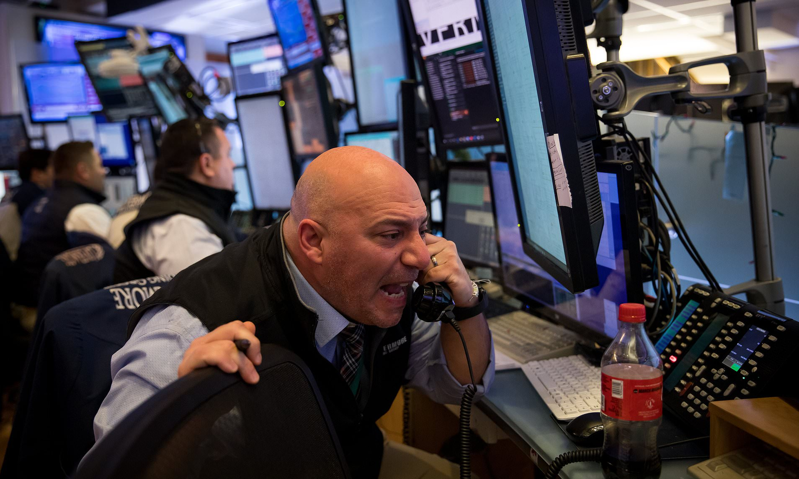

## Welcome to Volquake

(C) 2022 - John Edwards

This project demonstrates streaming prices over a reactive websocket then put over a stomp websocket into an angular UI

- You don't need to start any docker services because RabbitMQ is commented out for now. You can experiment with comparing reactive websocket vs RabbitMQ which is also now [reactive](https://projectreactor.io/docs/rabbitmq/snapshot/reference/)

- Start `price-request` (this is the where it asks for the price stream so simulating a blotter)

- Start `pricing` (this is the where the prices can be generated simulating a [Generalized Wiener Process](https://en.wikipedia.org/wiki/Generalized_Wiener_process#:~:text=In%20statistics%2C%20a%20generalized%20Wiener,at%20every%20point%20in%20time.) or [Brownian Motion](https://en.wikipedia.org/wiki/Brownian_motion). This is cool finance shizzle and if you're interested I'll explain it to you )

- Start the UI in `price-request` with `npm serve` 

- Go to [http://localhost:4200/](http://localhost:4200/) and be awestruck by my Angular pimp game. ("_hey... did I tell you I was full-stack, baby?_") Actually, I think it hardcodes the ticker to `VOD.L` right now but you can change the UI to pass another ticker but they must be listed in the config otherwise it doesn't have the stochastic parameters.

- The stocks prices generated for are in `stocks.csvl` and the required parameters are underlying, [mu](https://homework.study.com/explanation/the-expected-return-on-the-market-portfolio-mu-m-e-rm-15-the-standard-deviation-is-sigma-m-25-and-the-risk-free-rate-is-rf-5-suppose-the-capm-holds-a-draw-on-a-diagram-with-the-capi.html) (i.e. the mean drift or expected yearly return), [sigma](https://en.wikipedia.org/wiki/Volatility_(finance)) (volatility) and startPrice - so if you can crank up volatility to make prices bounce around even more but then they could go to zero and you've bankrupted your firm! There is a `dt` setting somewhere which is the time duration between ticks. I think this is hardcoded too but doesn't need to be. The `interval` setting  in `application.yaml` is how often prices get published so if you want to simulate real-time you need this to match your `dt` 

```
publisher:
  configurationFile: stocks.csv
  intervalInMills: 50
```

- Now pour yourself a [brandy](https://www.courvoisier.com/en-gb/) - [possibly](https://www.cdc.gov/tobacco/basic_information/health_effects/cancer/index.htm) break out the [cuban cigars](https://www.havanahouse.co.uk/product-category/cuban/montecristo/) - and read Louis Bachelier's [Theory of Speculation](https://press.princeton.edu/books/hardcover/9780691117522/louis-bacheliers-theory-of-speculation). (Possibly the second most famous French stockbroker after [Paul Gaughin](https://en.wikipedia.org/wiki/Paul_Gauguin) ) 


Trade safely, kids. And remember it's no fun being broke.
